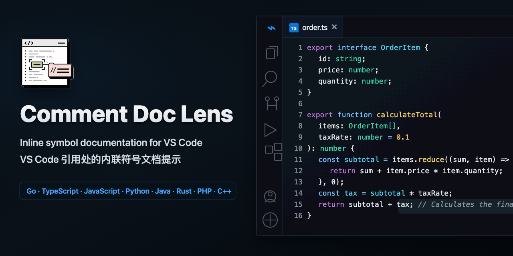
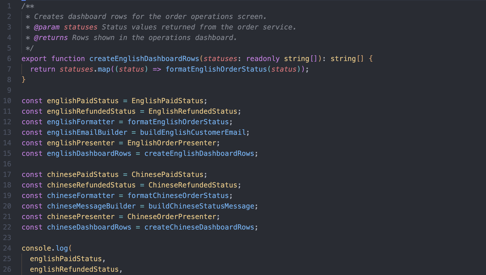
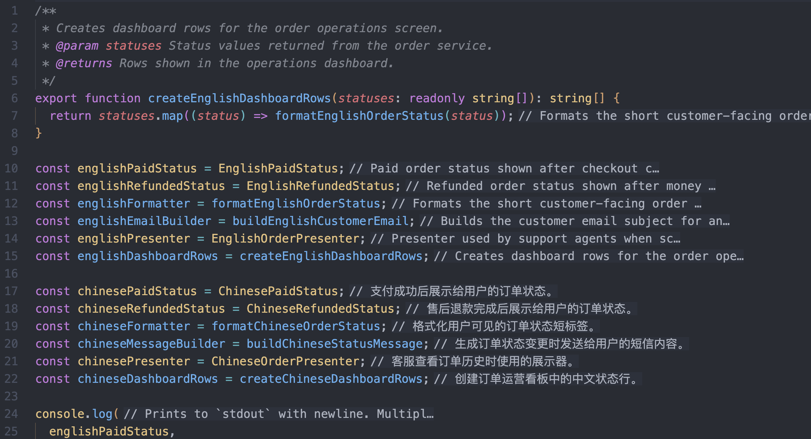

<p align="center">
  
</p>

<h1 align="center">Comment Doc Lens</h1>

<p align="center">
  在 VS Code 引用处以内联提示展示定义注释与符号文档。
</p>

<p align="center">
  简体中文 | <a href="README.md">English</a>
</p>

<p align="center">
  <a href="https://github.com/tzzs/comment-doc-lens">
    
  </a>
  <a href="https://github.com/tzzs/comment-doc-lens/issues">
    
  </a>
</p>

<p align="center">
  
</p>

## 演示

| 开启前 | 开启后 |
| --- | --- |
|  |  |

## 为什么需要它

Comment Doc Lens 把有用的定义文档放回你正在阅读的代码旁边。只要引用到的符号带有文档注释、JSDoc、docstring、Javadoc、PHPDoc，或语言服务能够返回有价值的 hover 文档，扩展就会把第一条有用摘要展示在当前行末尾。

它面向阅读和理解代码，不会修改源文件。Comment Doc Lens 不生成注释、不重写代码、不高亮 TODO，也不索引注释锚点。

## 它展示什么

Comment Doc Lens 会扫描当前可见的标识符，调用 VS Code 当前语言服务的 hover 与 definition 能力，然后把简洁的文档摘要渲染成 inlay hint。

适合这些场景：

- 阅读带有文档的函数、常量、变量、方法、枚举成员和对象属性。
- 不跳转离开当前文件，也能看到定义处的说明。
- 保持提示短小、只展示信息，并且默认不附带跳转交互。
- 检查当前语言服务是否能提供可用文档。

提示默认显示在行尾，避免插入到表达式中间。默认前缀是 `// `，默认摘要长度上限是 `120` 个字符。

## 语言支持

| 等级 | 语言 | 说明 |
| --- | --- | --- |
| 稳定推荐 | Go、TypeScript、JavaScript、TSX、JSX、Python、Java、Rust、PHP | 推荐日常使用，已有测试、fixture、文档说明，并在适用时提供 fallback。 |
| 实验支持 | C#、Ruby、Kotlin、Swift、C、C++ | 已可使用，但更依赖推荐语言扩展、项目索引和后续真实语言服务验证。 |

非内置语言建议安装对应的推荐扩展。Go 推荐官方 Go 扩展和 `gopls`；Python 推荐 Python 扩展和 Pylance；Rust 推荐 rust-analyzer。

完整支持等级、文档来源能力、推荐依赖、fallback 策略和验证状态见 [语言支持矩阵](docs/language-support.md)。

## 命令

| 命令 | 用途 |
| --- | --- |
| `Comment Doc Lens: Toggle` | 开启或关闭内联文档提示。 |
| `Comment Doc Lens: Refresh` | 清理缓存并刷新提示。 |
| `Comment Doc Lens: Show Language Status` | 检查当前文件语言服务是 ready、degraded、missing dependency 还是 unknown。 |
| `Comment Doc Lens: Diagnose Workspace` | 扫描代表性工作区文件并输出语言服务健康报告。 |
| `Comment Doc Lens: Copy Diagnostics for Issue` | 复制最近诊断事件，生成可粘贴到 GitHub issue 的 Markdown。 |
| `Comment Doc Lens: Explain Hidden Hint` | 解释当前行为什么没有显示内联文档提示。 |
| `Comment Doc Lens: Open Sample Gallery` | 打开代表性的内联文档示例。 |

## 语言服务状态

在命令面板运行 `Comment Doc Lens: Show Language Status` 可以检查当前文件。状态检查会验证推荐扩展、hover 输出、definition 输出，以及当前 adapter 是否具备源码注释 fallback。

- `ready`：语言服务能够提供可用文档。
- `missingDependency`：推荐扩展未安装或未启用。
- `degraded`：语言服务存在，但 hover 或 definition 输出暂时不够有用。
- `unknown`：Comment Doc Lens 无法判断当前语言服务状态。

如果状态是 `missingDependency`，请安装或启用提示中的推荐扩展。如果状态是 `degraded`，请把光标放在带文档的符号上，并确认项目索引已经完成。

`sourceFallback=true` 表示 adapter 可以在 hover 缺失时尝试读取定义附近的源码注释，但它不能替代推荐语言扩展。Java、C# 或其他外部语言服务未安装时，`missingDependency` 加 `sourceFallback=true` 是预期状态。真实项目请安装提示中的扩展和工具链；手工同文件 fixture 请确认光标在调用点、运行 `Comment Doc Lens: Refresh`，并使用最新安装的 VSIX。

反馈缺失提示前，请先运行 `Comment Doc Lens: Show Language Status`、`Comment Doc Lens: Explain Hidden Hint` 和 `Comment Doc Lens: Copy Diagnostics for Issue`。缺失提示 issue 模板会要求粘贴这些输出，方便维护者区分配置、语言服务、fallback 和超时问题，同时不需要收集源码。

## 配置项

| 配置 | 用途 |
| --- | --- |
| `commentDocLens.enabled` | 开启 Comment Doc Lens。 |
| `commentDocLens.languages` | 指定 Comment Doc Lens 运行的已注册 adapter 语言。 |
| `commentDocLens.languageOverrides` | 按语言开启或关闭 Comment Doc Lens。 |
| `commentDocLens.maxHintsPerRequest` | 限制单次 inlay hint 请求生成的提示数量。 |
| `commentDocLens.maxLineLength` | 跳过过长的生成代码或压缩代码行。 |
| `commentDocLens.maxHintLength` | 限制摘要展示长度。 |
| `commentDocLens.minimumDocumentationWords` | 过滤过短、低信号的摘要。 |
| `commentDocLens.minIdentifierLength` | 忽略过短标识符，除非文档带有定义位置。 |
| `commentDocLens.preferPropertyTail` | 在 `foo.bar.baz` 这类属性链中优先取末尾标识符。 |
| `commentDocLens.dedupeLineHints` | 去重同一行上的重复摘要。 |
| `commentDocLens.resolveTimeoutMs` | 限制单次文档查询耗时。 |
| `commentDocLens.maxCacheEntries` | 限制 resolver 缓存规模。 |
| `commentDocLens.hintPrefix` | 自定义摘要前缀。 |
| `commentDocLens.enableHintInteractions` | 可选开启 inlay hint tooltip 和定义位置跳转。 |

## 已知限制

Comment Doc Lens 只在已注册 adapter 语言的 `file` 文档中运行，并且受配置开关控制。覆盖范围和文案质量取决于各语言服务的 hover 与 definition provider。

当 hover 没有可用文档时，带 source fallback 的 adapter 可以读取定义附近的前置源码注释。超时处理可以避免展示过期提示，但已经发出的 VS Code command 调用无法被扩展强制取消。

## 开发

```bash
npm install
npm run compile
npm test
```

发布前建议运行：

```bash
npm run compile
npm test
npm run package
```

本地 VS Code/Electron host 可用时，再运行 `npm run test:integration`。

## 链接

- [English README](README.md)
- [语言支持矩阵](docs/language-support.md)
- [示例库](docs/sample-gallery.md)
- [不生成注释的行内文档](docs/articles/inline-docs-without-generating-comments.md)
- [维护指标](docs/maintenance-metrics.md)
- [发布质量清单](docs/release-quality-checklist.md)
- [更新日志](CHANGELOG.md)
- [MIT License](LICENSE)
